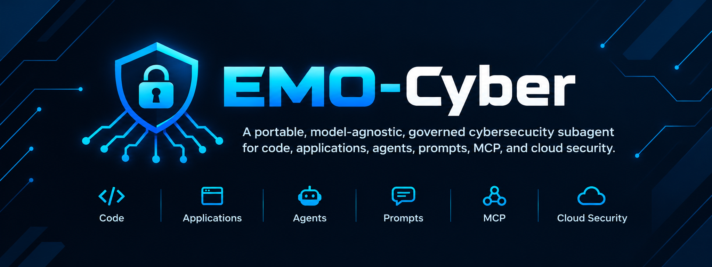

# EMO-Cyber-Agent

A portable, model-agnostic, governed cybersecurity subagent
for code, applications, agents, prompts, MCP, and cloud security.

Portable, model-agnostic cybersecurity sub-agent for software projects.

EMO-Cyber-Agent is designed to be installed once as a Python package and then invoked through:

- MCP for agent hosts such as coding assistants and IDE agents.
- CLI for humans, CI/CD, and agents that can execute commands.
- Python API for embedding and automation.

The project is intentionally **model-agnostic**. Model weights, GPU/runtime deployment, and provider-specific infrastructure are out of scope for this repository. The core product is the security methodology, agent control loop, tool contracts, evidence model, policy enforcement, and stable interfaces.

## Design goals

1. Portable across agent hosts.
2. Read-only by default.
3. Evidence-first findings: every material claim must point to evidence.
4. Security-specialist behavior: the host agent delegates security work; EMO owns the security workflow.
5. Deterministic tools around probabilistic reasoning.
6. Verification before escalation when safe and permitted.
7. Strict separation between untrusted repository content and agent instructions.
8. Stable JSON schemas so MCP, CLI, and Python API return the same result model.
9. Pluggable tool adapters and model providers.
10. No required dependency on a particular LLM, cloud, IDE, or repository platform.

## Non-goals

- Building a general-purpose coding agent.
- Bundling model weights.
- Automatic production changes by default.
- Replacing SAST, SCA, secret scanners, DAST, runtime security, or human security review.
- Exploit development or offensive operation against systems without explicit authorization.

## Repository map

```text
EMO-Cyber-Agent/
├── docs/                         # Specifications and implementation plan
├── src/emo_cyber_agent/          # Package skeleton
├── tests/                        # Unit/contract/fixture test plan
├── examples/                     # Integration examples
├── scripts/                      # Developer utilities
├── .github/workflows/            # CI templates
├── pyproject.toml
├── .env.example
└── Makefile
```

## Development status

Core engine (domain, policy, tools, evidence, reasoning, verification,
findings, reporting) plus MCP and CLI adapters are implemented and tested
according to `docs/16-implementation-plan.md`. Progress is recorded per
task in `reports/development/ECA-T*.md`.

## Installation

```bash
pip install emo-cyber-agent
cyber-agent --help
```

Optional isolation:

```bash
pipx install emo-cyber-agent
```

From source (developers):

```bash
pip install -e '.[all]'   # package + MCP/HTTP/dev extras
```

## Quickstart

```bash
cyber-agent audit . --format json > result.json
cyber-agent report --findings findings.json --audit-id <id> --format markdown
cyber-agent mcp   # stdio server for MCP hosts (OpenCode, Hermes, pi, Cline, VS Code, …)
```

## Commands

```text
cyber-agent doctor                                  # operational presence checks (no secrets printed)
cyber-agent audit <target> [--mode quick|standard|deep] [--focus a,b] [--format human|json]
cyber-agent review <target> [--focus a,b] [--format human|json]
cyber-agent verify --candidate cand.json --method <m> --kind <k> --locator <loc> --rationale <r> --audit-id <id>
cyber-agent status <audit_id>                       # read-only; unknown audits report NOT_FOUND
cyber-agent report --findings findings.json --audit-id <id> --format json|jsonl|markdown
cyber-agent mcp                                     # MCP stdio server (thin adapter over Core)
```

Only implemented options exist — there are no `--shell`, `--exec`,
`--grant`, `--sudo`, `--allow-write`, or `--bypass-policy` flags, and no
`--github-token`-style secret flags (use environment/secret providers).

## Output formats and exit codes

- `--format json` emits machine-readable JSON on stdout; diagnostics go to
  stderr, so `cyber-agent audit . --format json > result.json` stays clean.
- Findings never change the exit code; command status and security results
  are separate concerns.

```text
0 SUCCESS · 1 AUDIT/DOMAIN FAILURE · 2 INVALID INPUT · 3 POLICY DENIED ·
4 SECURITY BLOCKED · 5 PROVIDER/TOOL UNAVAILABLE · 6 VERIFICATION
INCONCLUSIVE · 7 INTERNAL ERROR · 130 interrupted (POSIX standard)
```

## CI example

```bash
cyber-agent audit . --format json > result.json
python -c "import json; print(json.load(open('result.json'))['result']['status'])"
```

## Security model

Read-only by default; repository content is untrusted data; no material
finding without evidence; no destructive action without an explicit
permission transition; MCP and CLI are thin adapters — Core decides,
tools prove, verification confirms, reporting projects.

Progress is advisory-only (never authorizes actions). Recovery is bounded
and fail-closed (`POLICY_DENIED` / `INTEGRITY_FAILURE` never retry).
Host-supplied context is untrusted until scope-bound by Core/Policy.

## Host integration

Register EMO once as an MCP server, then delegate security work from any
compatible host. Full per-host guides live in `docs/integrations/`.

```json
{ "mcpServers": { "emo-cyber-agent": { "command": "cyber-agent", "args": ["mcp"] } } }
```

| Host | Status |
|---|---|
| Generic MCP host (stdio) | Contract Tested |
| OpenCode | Supported (config), Contract Tested discovery |
| Pi (stdio / Streamable HTTP) | Supported (config), project-scoped |
| Hermes (per-server filtering) | Supported (config), least-surface guidance |
| Jan (Desktop + Agent/CLI shared config) | Supported (config) |
| AnythingLLM (workspace/RAG = untrusted inputs) | Supported (config), boundary guidance |

Levels: Supported = config + mapping shipped; Contract Tested = in-repo
contract tests; Environment Tested = live binary exercised (where available);
otherwise Not Tested — see `docs/integrations/` per host.

## Limitations

Read-only analysis; no auto-remediation, no exploit capabilities, no
scores-as-verdicts. Live-host interop beyond contract tests is
environment-dependent (see host docs). Progress never gates security
decisions; recovery never mutates policy, evidence, or findings.
